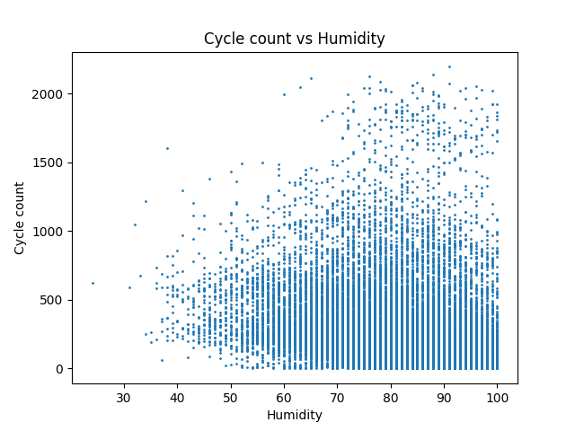
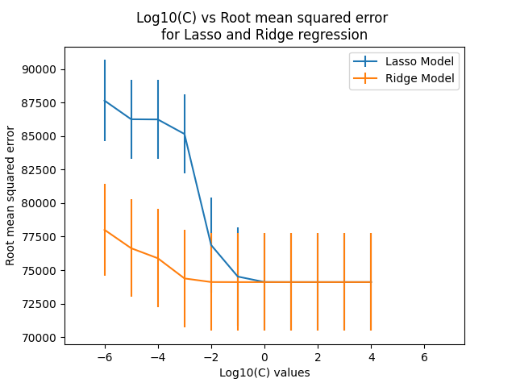

# CSU44061_Team_Project
This is the repository for our Machine Learning Project for the module CS7CS4/CSU44061 Machine Learning

## How to make a commit using the makefile (assuming you have correct access rights and **make** is installed and working)
```make git m="Commit Message"```

## Machine Learning Models Used
1. Linear Regression
2. Lasso Regression
3. Ridge Regression
4. KNN Regression


## Graphs Generated








