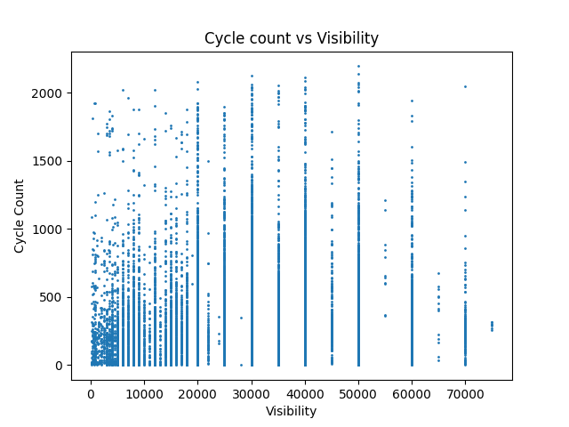

# CSU44061_Team_Project
This is the repository for our Machine Learning Project for the module CS7CS4/CSU44061 Machine Learning

## How to make a commit using the makefile (assuming you have correct access rights and **make** is installed and working)
```make git m="Commit Message"```

## Machine Learning Models Used
1. Linear Regression
2. Lasso Regression
3. Ridge Regression
4. KNN Regression


## Graphs Generated

### Number of Cycles vs Hour of the Day


This is the model most focused on as the most real-world interaction can be easily seen from it. Tracking the hours of the day over the cycle count initially without any of the added weather variables we had, we could see that it was always the case that regardless of the weather, the cyclists had clear trends of cycling at certain times. It's easy to deduce that these times coincide with the start and end of the workday.

### Cycle Count vs Amount of Rain


From the previous graph we could then move on to look at how the most basic weather had an impact on the cyclists and as we expected would happen, as soon as rain was introduced, the cyclists saw an immediate drop off in numbers. While some instances of cyclists can be seen in levels of high rain, as each dot on the graph stands for a certain number of cyclists on a given day, the distributions in the higher amounts of rain make it clear to see the two variables have an inverse relationship.

### Cycle Count vs Temperature


Using this data of Cycle Count versus Temperature, we can see that we have a roughly, evenly distributed range of data centred around a base of 10 degrees. Surprisingly to us we can see that there is an incredibly low number of days where there are few cyclists on days above 17 degrees, eventually always having at least 250 people cycling on those days. This graph shows us that people are still willing to cycle in the cold but clearly as it gets colder and colder the number of people cycling every day gets less and less until it gets to -5 degrees Celsius in which people decide it is too cold to cycle. On the other hand, at extremely high temperatures cyclists will keep going out to cycle in consistent numbers even up to as high as 27 degrees Celsius, although this number does seem to be an outlier, only because the number of days where the temperature was that high was not achieved much in Ireland in our timeframe. If we had more time to see the absolute ranges of temperature that people could cycle in, we could compare the data we have with data from hotter climates to see how high the temperatures people can cycle in and from this data we could see if people's ranges change based on what temperature they are used to. 
An unfortunate point about this is that our data will always be constrained by the temperatures that the location we choose will give us, so we can never fully see the cyclists ranges but we can strongly say generally what cyclists habits are in Ireland's climate.

### Cycle Count vs Humidity Level


Unlike the other graphs we can't take as much from this graph as we can from the others about cyclists riding habits as the only thing we can see for certain is that below 50 percent humidity, the amount of consistent cyclists drops sharply, likely tying in to lower temperatures, with dry biting cold air. 

### Cycle Count vs Wind Speed


Unlike the previous graph we can see clearly from this graph the relationship between the cyclists and high wind speeds. The wind speeds we have recorded are all in small incriments but you can see that as the wind speed goes up beyond 20, the number of cyclists finding it safe to cycle in Dublin decreases sharply. From this we can say that cyclists clearly like a slow wind speed of between 5 and 10.

### Cycle Count vs Wind Direction


Unlike the previous graph, gauging wind speed, we can see from this graph on wind direction that there is no clear correlation between where the wind is blowing to the number of cyclists on the road, as no matter which direction we choose, there is a consistent amount of cyclists on the roads.

### Cycle Count vs Sun Duration


This graph of the Cycle Count in relation to the duration of the sun shows a rough quadratic relationship where the majority of the values are at 0 Sunlight and 1 Sunlight. The Sunlight Duration is measured at 0 for times when there is no sunlight, for example, later hours and night. The 1 value, is for the times where there's full sunlight, so it makes sense for the most of the data points to be congregated towards the left and right, as it normally either night or from 08:00 and 17:00 it will be 1. Because of this information this graph doesn't tell us too much information that we didn't already know.

### Cycle Count vs Visibility


The data from this graph is laid out so that as the Visibility gets closer to zero, the more data points are shown. Visibility is estimated from the intensity of scattered light, which increases when there are more fog droplets, smoke or haze particles, raindrops or snowflakes in the beam. We can tell from this graph that as the visibility decreases, the amount of cyclists decreases signifigantly, as shown by the heavy collection of low points nearer to 0,0 in the graph compared to the distribution of the rest of the points. As the visibility increases the number of cyclists increases very consistently, showing a clear inverse relationship between the weather effects that lower visibility and the cyclists that choose to ride in those conditions. 

### Cycle Count vs Amount of Cloud


### Comparision of Lasso and Ridge Model with C values


### Root Mean Square error for KNN model for k values


### Comparision of Models


